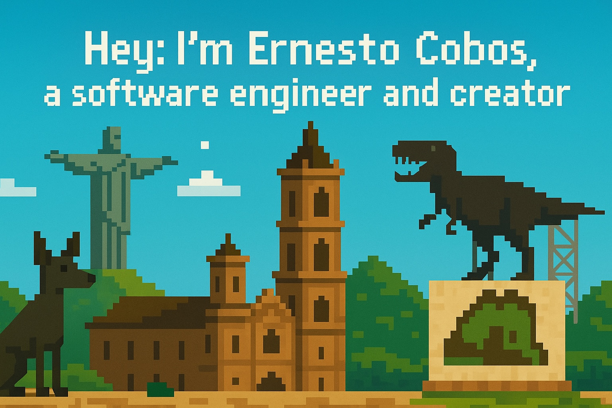

# Hi, I'm Ernesto Cobos ✨  
  

  

Hello! I'm a self -taught developer from México 🇲🇽 who later completed a degree in Software Engineering. Today I balance my time between working as a DevSecOps engineer at Ford, where I help secure and automate complex systems, and leading VoltaFlow, my own company focused on building applications and infrastructure that empower businesses to grow.  

## ✯️ A story about building things  
My journey into code began by writing small scripts and automations to solve my own problems. Those first tools sparked a hunger to learn more—about cloud infrastructure, modern web frameworks, and the art of creating great user experiences. Over the years that curiosity has evolved into a passion for building reliable systems and delightful products.  
Along the way, I built Enkiflow, a time tracking application designed to help teams stay on top of their hours and projects. The idea came from my own need for a simple yet powerful tool to organise work. Now it's available for anyone at [enkiflow.com](https://www.enkiflow.com).  
I'm always learning—whether it's exploring new programming languages, experimenting with DevOps and DevSecOps tools, or diving into areas like design and even agriculture. I believe that great products come from the intersection of technology and human insight, and I'm always looking for new ways to make that intersection shine.  

## 💻 Tech Stack  

**Languages & Scripting:**  
   square&logo=javascript&logoColor=black)](https://developer.mozilla.org/en-US/docs/Web/JavaScript)   

**DevOps & Automation:**  
   =white)](https://www.terraform.io/)   

**Frameworks & Libraries:**  
 [ ](https://laravel.com/)  

**Database & Backend:**  
  

**Cloud & Hosting:**  
      

## 🚀 Projects  
- [**CMI**](https://github.com/ErnestoCobos/cmi) — Automatic CMI number generation & dog approval workflow.  
- [**VoltaFlow**](https://github.com/ErnestoCobos/voltaflow) — Marketing site & infrastructure‑as‑code for the VoltaFlow platform.  
- [**DevOps**](https://github.com/ErnestoCobos/DevOps) — Infrastructure repository using Terraform, Ansible, Bash, JS/TS & Python.  
- [**Enkiflow**](https://github.com/ErnestoCobos/enkiflow-timesheet) — Time‑tracking app built with Next.js & Supabase, also available at [enkiflow.com](https://www.enkiflow.com).  

## 📊 GitHub Stats  
|  |  |  |  

## 📧 Contact  
  
